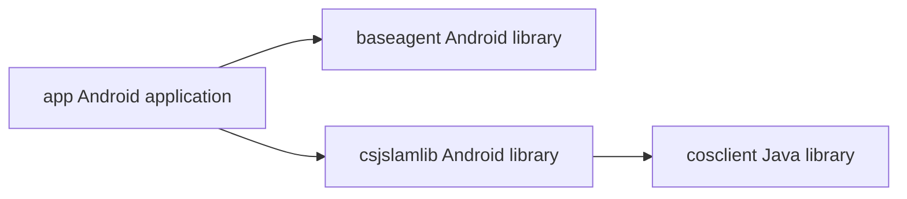
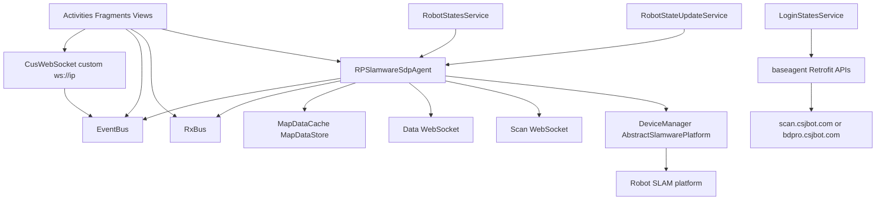
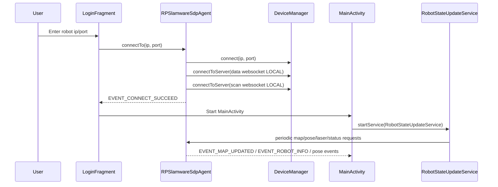
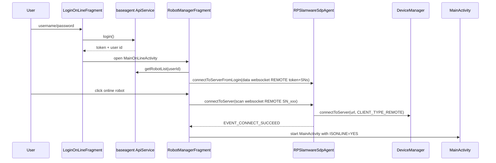

# CsjRobotStation Architecture

## 1) Scope And Method

This document describes the **current architecture** of the code in this workspace and a **target architecture** to reduce coupling and runtime risk.

The analysis is based on:
- Gradle module wiring
- Android manifest/runtime entry points
- Agent/transport/service internals
- UI flows for local and online robot operations

Important boundary:
- `csjslamlib` is declared as a git submodule (`.gitmodules`) but its source is not present in this workspace snapshot.
- This means SLAM core behavior is treated as an external dependency boundary.

## 2) System Context

The app is an Android robot station client with two operation modes:
- **Local robot mode**: connect directly to robot SLAM endpoint by IP/port.
- **Online/remote mode**: user logs in to cloud backend, selects robot, then connects by scan/data websocket channels.

Main user-facing capabilities:
- Robot connect/disconnect and status
- Live map rendering (map + pose + laser + overlays)
- Navigation and map editing (virtual wall/track/special area)
- Build/continue-build map workflows
- Robot fleet list and remote robot selection
- Voice/point/task management via a separate websocket protocol

## 3) Module Architecture

### 3.1 Gradle Module Graph

Current module wiring in build files:
- `settings.gradle` includes `:app`, `:baseagent`, `:cosclient`, `:csjslamlib`.
- `app` depends on `baseagent` and `csjslamlib`.
- `csjslamlib` exports `cosclient` via `api`.

### 3.2 Module Responsibilities

#### `app`
- Android UI, activities/fragments, map visualization, workflow orchestration.
- Holds app-wide `RPSlamwareSdpAgent` instance via `MyApp`.
- Owns robot polling services and event bus dispatch.

Key packages:
- `activity`, `fragment`: screens and user flows.
- `agent`: command/job orchestration around SLAM/platform operations.
- `data`: map cache and map coordinate conversion.
- `rx_event`: event keys + event bus wrappers.
- `service`: periodic state/login polling services.
- `widget`: map/control custom views.
- `utils`: bitmap/map processing, settings, app utilities.

#### `baseagent`
- HTTP API layer for login, robot list, login-state checks, signatures, state upload.
- Retrofit + RxJava abstraction with environment-dependent base URLs.

#### `csjslamlib` (external boundary in this workspace)
- Expected to contain or expose `com.slamtec.slamware.*` and `com.csjbot.slamlib.*` functionality used heavily by `app`.
- Declared as submodule, source missing in this checkout.

#### `cosclient`
- Java transport library (Netty socket connector).
- Packet framing/protocol (`AA AA 00 00` header + length + payload).
- Send queue, heartbeat, reconnect behavior, event callbacks.

## 4) Runtime Architecture

### 4.1 High-Level Runtime Components

### 4.2 App Startup

1. `SplashActivity` opens `LoginOnLineActivity`.
2. `MyApp` initializes:
- `RPSlamwareSdpAgent` singleton-like app instance.
- X libraries, update/crash monitoring.
- `RetrofitFactory.initClient()`.
- Bugly initialization on a background thread.

### 4.3 Local Robot Flow (Direct IP/Port)

### 4.4 Online/Remote Flow

### 4.5 Map Build/Edit Runtime

- `MainActivity`: navigation map mode, live overlays, side control actions.
- `CreateNewMapActivity`: build/continue-build map modes, save/export/load map.
- Edit screens:
- `VirtualWall*`, `VirtualTrack*`, `RubberActivity`, `SpecialAreaActivity`, `LocationActivity`.

Core loop driver:
- `RobotStateUpdateService` thread loop (~33ms sleep) triggers periodic fetches based on counters:
- pose, velocity, map data, laser scan, target pose, work mode, virtual walls/tracks, localization quality, special areas.

## 5) Communication Architecture

### 5.1 SLAM Command Channel

- `RPSlamwareSdpAgent` wraps `AbstractSlamwarePlatform`.
- Commands are represented as internal `Job*` runnables.
- Jobs are queued in `Worker` (`ArrayList<Runnable>` + cached thread pool execution).
- Events fan out through both:
- `RxBusUtils` string-key events
- `EventBusUtils` typed events

### 5.2 Cloud HTTP Channel

`baseagent` APIs include:
- Login (`scan/loginController/login`)
- Login state polling (`scan/loginController/judgeLogin`)
- Robot list (`scan/robotInfoStatus/select`)
- Robot status insert and other support APIs

Base URL strategy:
- debug/test points to test domains.
- release points to production domains.

### 5.3 WebSocket Channels

There are two distinct websocket families:

1) **Slamware/device manager websocket** (scan/data channels)
- Built from `RobotConfig.getScanURL/getDataURL`.
- Used for remote/local robot session and robot push status.

2) **Custom websocket (`CusWebSocket`)**
- Direct ws to configurable string `ws://<ip>`.
- In multiple flows currently called with hard-coded `"192.168.99.101:8081"`.
- Used by voice/point/task features (`AddPointUtils` command protocol).

## 6) State And Data Architecture

### 6.1 Core Runtime State

- Global app context:
- `MyApp.appContext`
- `MyApp.connectionSucceeded`
- `MyApp.agent` (single `RPSlamwareSdpAgent` instance)

- Agent-owned state:
- connection and platform references
- current pose/target pose
- map cache (`MapDataCache`)
- laser/depth/virtual wall/virtual track/special area states
- map list and current map metadata

### 6.2 Map Data Pipeline

1. Agent requests map (`getMap(...)`) by map kind.
2. `MapDataCache.update(Map)` stores map bytes + origin + resolution + dimensions.
3. `BitmapUtil` transforms bytes to bitmap and overlays:
- base coordinate
- robot pose and target
- laser scan
- virtual walls/tracks
- special areas
- depth cloud
4. UI updates map image in `MixedMapView`.

### 6.3 Persistence

- MMKV (`MMKVUtils`) for app settings:
- language, login preferences, map-layer toggles, speed settings, etc.
- SharedPreferences (`SharedPreUtil`) for voice/point websocket payload caches.
- File/system storage usage:
- SN file read/write under external storage path (`.robot_info/.sys.txt`)
- map import/export paths and snapshots

## 7) UI Architecture

- Built around Activities + Fragments.
- Shared base classes:
- `BaseActivity` (`XPageActivity`) with common title, lifecycle hooks, connection-lost dialog.
- `BaseFragment` (`XPageFragment`) with title/progress wiring.

- Interaction pattern:
- UI events -> agent commands.
- Agent/service events -> RxBus/EventBus -> UI redraw/state changes.

- Map interaction:
- `MixedMapView` converts touch events into `EVENT_TAP_EVENT`.
- Main/build activities transform touch -> robot-world coordinates -> `agent.moveTo(...)`.

## 8) Concurrency And Scheduling

### 8.1 Key Threads/Executors

- `RobotStateUpdateService` dedicated loop thread.
- `Worker` job queue executor for agent commands.
- Retrofit/OkHttp background threads + Rx observers.
- Netty event loops in `cosclient`.
- Android main thread for UI updates and some event subscriptions.

### 8.2 Timing Cadence

- State update loop: every ~33ms tick + modulo-based periodic calls.
- RobotStatesService battery poll: every 2 minutes.
- RobotStatesService work-state poll intent: every 10 seconds.
- LoginStatesService poll: every 10 seconds (after initial 5-second delay).
- `ClientManager` heartbeat interval: 5 seconds.

## 9) Build And Release Architecture

- Multi-build types: `debug`, `for_test`, `release`.
- Variant-based APK naming and output folder customization.
- Walle multi-channel packaging plugin enabled.
- X-library plugin stack (`XAOP`, `XRouter`) auto-injected by gradle scripts.
- App signing values and some credentials currently live in repo gradle files.

## 10) Observability And Diagnostics

- Logging:
- `CosLogger` across transport/agent/map flows
- logback config writes logs to external storage and logcat
- Runtime diagnostics:
- ANR watchdog
- Bugly crash reporting
- debug floating tools service (`SlamDebugFloatingWindowService`)

## 11) Architectural Risks (Current State)

1. **Missing submodule source in workspace**
- `csjslamlib` boundary is opaque here; architecture and debugging are partially blind.

2. **High coupling in `RPSlamwareSdpAgent`**
- very large class with many responsibilities:
- connection management
- robot commands
- map pipelines
- websocket integration
- camera calibration jobs
- event dispatch

3. **Dual event systems**
- concurrent use of RxBus + EventBus increases mental overhead and event ownership ambiguity.

4. **Mixed protocols and hard-coded endpoints**
- custom websocket hard-coded addresses in multiple flows.
- http/ws domains embedded in code paths.

5. **Background loop aggressiveness**
- `RobotStateUpdateService` infinite loop with frequent polling may impact battery and CPU.

6. **Credential/secrets exposure**
- signing credentials and API-like constants are in source/gradle.

7. **Legacy storage/network posture**
- broad storage permissions and cleartext traffic enabled globally.

8. **Limited test coverage**
- no tests present in this workspace snapshot.

## 12) Target Architecture (Recommended)

### 12.1 Layered Refactor

Adopt explicit boundaries:
- `presentation` (activities/fragments/viewmodels/controllers)
- `application` (use cases/orchestration)
- `domain` (robot/map/fleet models + interfaces)
- `infrastructure`:
- `slam-gateway` (DeviceManager wrapper)
- `cloud-api` (Retrofit)
- `ws-client` (scan/data/custom websocket adapters)
- `storage` (MMKV/preferences/files)

### 12.2 Agent Decomposition

Split `RPSlamwareSdpAgent` into smaller services:
- `ConnectionService`
- `MapService`
- `NavigationService`
- `RobotTelemetryService`
- `VirtualConstraintService`
- `CameraCalibrationService`
- `RobotImportExportService`

Then expose a thin facade for UI use cases.

### 12.3 Unified Event Stream

- Replace mixed RxBus/EventBus with one event mechanism.
- Prefer typed sealed event models to string-key events.
- Define ownership and lifecycle boundaries per screen/service.

### 12.4 Endpoint And Config Strategy

- Move all domains/ports into environment config.
- Remove hard-coded websocket addresses from activity/fragment code.
- Use build-time injected config for test/staging/prod.

### 12.5 Polling Optimization

- Shift high-frequency polling to adaptive strategy:
- only poll fast when UI visible and robot active.
- backoff/reduce cadence in background or idle states.
- central scheduler with lifecycle awareness.

### 12.6 Security Hardening

- Remove secrets from repository.
- Use secure secret injection in CI/CD.
- Narrow storage permissions and migrate away from legacy external storage paths.
- Restrict cleartext traffic to required domains only.

### 12.7 Test Strategy

- Add unit tests for:
- coordinate conversion (`MapDataCache`)
- packet encode/decode (`cosclient`)
- scheduler/polling logic
- Add integration tests for:
- login + robot-list + connect flows
- map request + render event chain

## 13) Suggested Refactor Roadmap

### Phase 1 (Low risk, high value)
- Centralize endpoint/config constants.
- Add architecture package boundaries (without behavior changes).
- Add baseline tests for map conversion and packet protocol.

### Phase 2
- Split `RPSlamwareSdpAgent` into internal services behind same facade.
- Replace string-based event keys with typed events for new code paths.

### Phase 3
- Consolidate event bus mechanism.
- Introduce lifecycle-aware scheduling and polling backoff.
- Harden permissions and secret management.

### Phase 4
- Full clean architecture alignment (domain/use-case driven).
- End-to-end instrumentation coverage for critical robot workflows.

## 14) Quick Reference: Key Entry Points

- App: `MyApp`
- Launch: `SplashActivity`
- Login (local): `LoginFragment`
- Login (online): `LoginOnLineFragment`
- Robot list/selection: `RobotManagerFragment`
- Main runtime map: `MainActivity`
- Build map runtime: `CreateNewMapActivity`
- Fast robot polling: `RobotStateUpdateService`
- Agent core: `RPSlamwareSdpAgent`
- HTTP gateway: `baseagent` (`ApiService`, `RetrofitFactory`)
- Low-level socket transport: `cosclient` (`ClientManager`, `CosConnectorNetty`)

